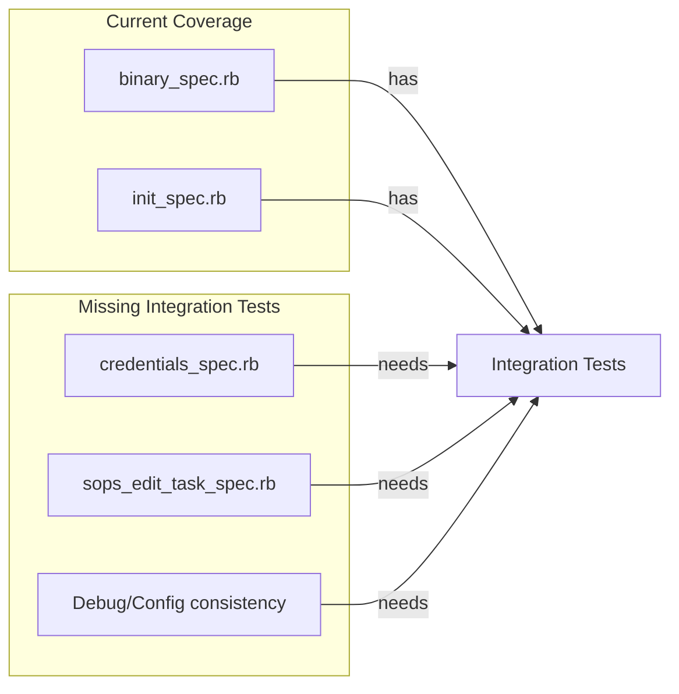

# Test Architecture Improvement Plan

## Problem Summary

The current test suite has several gaps identified from test incidents and architecture recommendations:

1. **False positive risk**: Several tests mock `Binary.decrypt` or `Binary.encrypt_to_file` with fake data without verifying actual SOPS output validity
2. **Missing round-trip tests**: `credentials_spec.rb` and `sops_edit_task_spec.rb` entirely mock Binary methods
3. **No shared test infrastructure**: No `spec/support/` directory with reusable helpers and shared examples
4. **Debug/Configuration divergence**: No tests ensuring `Debug.log_key_info` and `Configuration.resolved_age_key_file` report consistent values (per Incident #2)

## Test Coverage Analysis



---

## Implementation Plan

### 1. Create Shared Test Infrastructure

Create `spec/support/` directory with reusable components:**File: [`spec/support/shared_examples/sops_file_contract.rb`](spec/support/shared_examples/sops_file_contract.rb)**

- Shared example: `"a valid SOPS encrypted file"` that verifies:
- File contains `sops:` metadata
- File can be parsed as YAML with `sops` key
- File passes `sops --file-status` check
- File can be decrypted

**File: [`spec/support/helpers/sops_validation_helper.rb`](spec/support/helpers/sops_validation_helper.rb)**

- `valid_sops_file?(path)` - checks YAML structure has sops metadata
- `can_decrypt_with_sops?(path)` - verifies SOPS can actually decrypt
- `integration_test_prerequisites_met?` - checks for SOPS, age, and key file

**File: [`spec/support/shared_contexts/clean_environment.rb`](spec/support/shared_contexts/clean_environment.rb)**

- Consolidate the repeated `around` blocks for env var isolation
- Currently duplicated across 5+ spec files

### 2. Add Round-Trip Integration Tests to credentials_spec.rb

Currently all `.load` tests mock `SopsRails::Binary.decrypt`:

```ruby
# Current (false positive risk):
allow(SopsRails::Binary).to receive(:decrypt).and_return(yaml_content)
```

**Add integration tests that verify actual decrypt round-trip**:

- Create temp encrypted file using `Binary.encrypt_to_file`
- Load credentials via `Credentials.load`
- Verify values match original

### 3. Add Round-Trip Integration Tests to sops_edit_task_spec.rb

`ensure_template_exists` tests mock `Binary.encrypt_to_file`:

```ruby
# Current (false positive risk - lines 94-95):
allow(SopsRails::Binary).to receive(:encrypt_to_file).and_return(true)
```

**Add integration tests that**:

- Actually create the template file
- Verify it can be decrypted
- Verify it matches expected template structure

### 4. Add Debug/Configuration Consistency Tests

Per **Incident #2** (Private Key Resolution Divergence), add tests ensuring:

- `Debug.detect_key_source` and `Configuration.resolved_age_key_file` report the same key
- `Debug.info[:resolved_key_file] `equals `config.resolved_age_key_file`
- `Debug.info[:public_key] `equals `config.public_key`

This prevents the divergence bug where Debug reports one key but Configuration uses another.

### 5. Improve Unit Test Assertions

Update unit tests to verify command structure more precisely:

```ruby
# Current pattern in binary_spec.rb (line 332):
expect(Open3).to receive(:capture3) do |_env, *args|
  expect(args).to eq(["sops", "-e", "-i", file_path])
```

Extend this pattern to also verify:

- Environment hash contains expected keys when key file configured
- No `--age` flag when `public_key` is nil (line 388 does this well)

---

## Files to Create